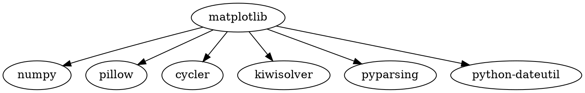

```dot
digraph G {
    "express" -> "accepts";
    "express" -> "array-flatten";
    "express" -> "body-parser";
    "express" -> "content-disposition";
    "express" -> "cookie";
    "express" -> "cookie-signature";
    "express" -> "debug";
    "express" -> "depd";
    "express" -> "encodeurl";
    "express" -> "escape-html";
    "express" -> "etag";
    "express" -> "finalhandler";
    "express" -> "fresh";
    "express" -> "merge-descriptors";
    "express" -> "methods";
    "express" -> "on-finished";
    "express" -> "parseurl";
    "express" -> "path-to-regexp";
    "express" -> "proxy-addr";
    "express" -> "qs";
    "express" -> "range-parser";
    "express" -> "safe-buffer";
    "express" -> "send";
    "express" -> "serve-static";
    "express" -> "setprototypeof";
    "express" -> "statuses";
    "express" -> "type-is";
    "express" -> "utils-merge";
    "express" -> "vary";
}
```

# Задание 1
```sh
pip show matplotlib
```

# Задание 2
```sh
npm show express
```
# Задание 3
```sh
sudo apt update
sudo apt install graphviz
nano matplotlib.dot
```

```sh
nano express.dot
```

```sh
dot -Tpng matplotlib.dot -o matplotlib-graph.png
dot -Tpng express.dot -o express-graph.png
```
# Задание 4
```mzn
include "globals.mzn";

array[1..6] of var 0..9: digits;

constraint digits[1] != 0;
constraint all_different(digits);

var 0..27: sum1 = digits[1] + digits[2] + digits[3];
var 0..27: sum2 = digits[4] + digits[5] + digits[6];
constraint sum1 = sum2;

var 0..999999: ticket_value = 
    digits[1] * 100000 + digits[2] * 10000 + digits[3] * 1000 +
    digits[4] * 100 + digits[5] * 10 + digits[6];

solve minimize ticket_value;
```
# Задание 5
